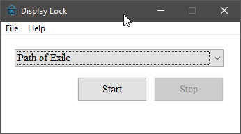

# Display Lock
 

Lightweight program that locks cursor in selected window, designed with performance in mind.

#### USES
------------------
- Keeps cursor in a windowed game to prevent clicking outside
- Will stay active while the window is focused
- Keeps cursor in a fullscreen game while using a multi-monitor setup
- Converts any window into a borderless and/or fullscreen window (when set in settings)

#### Contributing
----------------------
Contributions are always welcome, but please check [Contributing](CONTRIBUTING.md) guidelines before making a pull request.

#### EXAMPLE
---------------

# 
