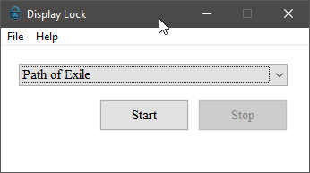

# Display-Lock

 [](https://www.codefactor.io/repository/github/stateford/display-lock) 


**Display-Lock** is a lightweight Windows application that locks your mouse cursor to a selected window. Designed with performance in mind, it's the perfect tool for gamers using multi-monitor setups or anyone who needs to prevent accidental cursor movement outside a specific window.

**Quick Links:** [Features](#features) | [Installation](#installation) | [Building](#building-from-source) | [Configuration](#configuration) | [Contributing](#contributing)

---

## Features

- **Cursor Locking** - Lock your cursor to a selected window with a single click
- **Window Selection** - Easy UI to choose from open windows on your system
- **Borderless Window Mode** - Convert any window to borderless for a cleaner look
- **Fullscreen Expansion** - Expand windows to fill your entire monitor
- **Application Whitelist** - Auto-lock cursor for specified applications
- **System Tray Integration** - Minimize to system tray with quick context menu access
- **Update Checker** - Automatic checking for new versions
- **Lightweight & Portable** - Pure Win32 API implementation with no external dependencies
- **Multi-Monitor Support** - Seamlessly works across multiple monitor setups

---

## Installation

### Download

Download the latest release from the [Releases page](https://github.com/Stateford/Display-Lock/releases/).

### System Requirements

- **Windows 10** or later
- No installation required - simply extract and run the executable

Display-Lock is fully portable and can be run from any location. No administrative privileges are required.

---

## Getting Started

1. **Download and run** the executable
2. **Select a window** from the "Window Select" tab
3. **Click "Lock Cursor"** to confine your cursor to that window
4. **Click "Unlock"** or switch focus to another window to release the lock

### Using the Tabs

- **Window Select**: Choose which window to lock the cursor to
- **Settings**: Configure application behavior
- **Applications**: Add applications to the whitelist for automatic cursor locking

---

## Configuration

Configuration files are stored in `%APPDATA%/DisplayLock/`. Settings are saved in a binary `.DLOCK` format.

### Available Settings

| Setting | Description |
|---------|-------------|
| **Minimize on Start** | Automatically minimize the application on startup |
| **Bring to Foreground** | Automatically bring the locked window to the foreground |
| **Borderless Window** | Convert the selected window to borderless mode |
| **Fullscreen** | Expand the window to fill the entire monitor |
| **Check for Updates** | Periodically check for new versions |
| **Minimize to Tray** | Hide the application in the system tray instead of taskbar |

---

## Use Cases

- **Gaming**: Keep your cursor confined to a windowed game, preventing accidental clicks outside the window
- **Multi-Monitor Gaming**: Play fullscreen games on one monitor without cursor drift to others
- **Window Management**: Convert borderless fullscreen windows for streaming or video capture
- **Application Monitoring**: Automatically lock cursor when specific applications are in focus

---

## Building from Source

### Requirements

- **CMake** 3.24 or later
- **Visual Studio 2022** with MSVC
- **Windows 10 SDK**

### Build Instructions

```bash
# Configure and build (Release)
cmake -B build -DCMAKE_BUILD_TYPE=Release
cmake --build build --config Release

# Configure and build (Debug)
cmake -B build -DCMAKE_BUILD_TYPE=Debug
cmake --build build --config Debug

# Run tests
ctest --test-dir build -C Release

# Run a specific test
ctest --test-dir build -C Release -R SettingsTest
```

The compiled executable will be in the `build` directory.

---

## Project Structure

- `src/` - Main application with Win32 UI
- `src/components/` - Core functionality library
  - `win.c` - Cursor locking logic
  - `settings.c` - Configuration persistence
  - `applications.c` - Application whitelist management
  - `notify.c` - System tray integration
  - `update.c` - Version checking
  - `menu.c` - Menu UI handling
- `tests/` - Google Test test suite
- `docs/` - Documentation and assets

For more details, see the [CLAUDE.md](CLAUDE.md) architecture documentation.

---

## Screenshots & Demo

### Main Application Window



### Borderless Window Mode


### Cursor Locking in Action


---

## Contributing

Contributions are always welcome! Please read our [Contributing Guidelines](CONTRIBUTING.md) before submitting a pull request.

### Pull Request Process

1. Discuss proposed changes via GitHub issues before starting work
2. Work on the `develop` branch (or a branch checked out from develop)
3. For hotfixes, work off the `master` branch
4. Update [CHANGELOG.md](CHANGELOG.md) with your changes
5. Add tests if applicable
6. Ensure all builds pass and tests succeed before submitting

### Things to Avoid

- External dependencies (this project prioritizes being lightweight)
- Manual version number changes or build script modifications
- Machine-specific project configurations

---

## License

This project is licensed under the **GNU General Public License v3.0** - see the [LICENSE](LICENSE) file for details.

---

## Support & Links

- **Report Issues**: [GitHub Issues](https://github.com/Stateford/Display-Lock/issues)
- **View Changelog**: [CHANGELOG.md](CHANGELOG.md)
- **Latest Releases**: [GitHub Releases](https://github.com/Stateford/Display-Lock/releases/)
- **Download Latest**: [Download](https://github.com/Stateford/Display-Lock/releases/)
